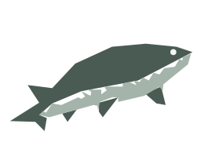

<!-- Improved compatibility of back to top link: See: https://github.com/othneildrew/Best-README-Template/pull/73 -->
<a id="readme-top"></a>

<!-- PROJECT SHIELDS -->
[![Contributors][contributors-shield]][contributors-url]
[![Forks][forks-shield]][forks-url]
[![Stargazers][stars-shield]][stars-url]
[![Issues][issues-shield]][issues-url]
[![License][license-shield]][license-url]


<!-- PROJECT LOGO -->
<br />
<div align="center">
  <a href="https://github.com/weekijie/Sturgeon">
    
  </a>

<h3 align="center">Sturgeon</h3>

  <p align="center">
    Clinical Debate AI for Differential Diagnosis
    <br />
    <em>Like House MD's diagnostic team, but AI-powered</em>
    <br />
    <a href="https://www.youtube.com/watch?v=3tTzITIdABQ">Video Demo</a>
  </p>
</div>


<!-- TABLE OF CONTENTS -->
<details>
  <summary>Table of Contents</summary>
  <ol>
    <li>
      <a href="#about-the-project">About The Project</a>
      <ul>
        <li><a href="#key-features">Key Features</a></li>
        <li><a href="#built-with">Built With</a></li>
      </ul>
    </li>
    <li>
      <a href="#getting-started">Getting Started</a>
      <ul>
        <li><a href="#prerequisites">Prerequisites</a></li>
        <li><a href="#installation">Installation</a></li>
        <li><a href="#configuration">Configuration</a></li>
      </ul>
    </li>
    <li><a href="#usage">Usage</a></li>
    <li><a href="#architecture">Architecture</a></li>
    <li><a href="#api-reference">API Reference</a></li>
     <li><a href="#roadmap">Roadmap</a></li>
     <li><a href="#branch-strategy">Branch Strategy</a></li>
      <li><a href="#local-vs-cloud-runtime">Local vs Cloud Runtime</a></li>
     <li><a href="#research--references">Research & References</a></li>
     <li><a href="#license">License</a></li>
     <li><a href="#acknowledgments">Acknowledgments</a></li>
  </ol>
</details>


<!-- ABOUT THE PROJECT -->
## About The Project

**Sturgeon** is a Clinical Debate AI that brings House MD-style differential diagnosis to solo practitioners and resource-constrained settings. When you don't have a diagnostic team to challenge your thinking, Sturgeon acts as your AI colleague—generating differentials, defending its reasoning, and adapting when you challenge its conclusions.

### The Problem

Medical diagnosis is hard, especially when working alone:
- **Cognitive bias** - Confirmation bias leads to missed diagnoses
- **No second opinion** - Solo practitioners lack diagnostic teams
- **Information overload** - Too many possible conditions, too little time
- **Diagnostic errors** - Leading cause of medical mistakes and patient harm

### The Solution

Sturgeon simulates a **diagnostic case conference** using AI:

1. **Upload evidence** - Medical images, lab reports, patient history
2. **Get differential** - AI generates ranked diagnoses with reasoning
3. **Challenge the AI** - Question its conclusions, suggest alternatives
4. **Refine together** - AI updates its differential based on your input
5. **Reach consensus** - Final diagnosis with full reasoning chain

Built for the [MedGemma Impact Challenge](https://www.kaggle.com/competitions/medgemma-impact-challenge) - targeting the Main Track + Agentic Workflow Prize.

<p align="right">(<a href="#readme-top">back to top</a>)</p>


### Key Features

- **🧠 Agentic Dual-Model Architecture** - Gemini orchestrator + MedGemma specialist
- **📊 Multi-Modal Analysis** - Process medical images + lab reports simultaneously  
- **🔍 RAG-Enhanced Reasoning** - Clinical guidelines with automatic citation extraction
- **🚀 Production Queue Hardening** - Modal input concurrency + Vercel timeout alignment
- **🛡️ Hallucination Prevention** - Auto-validation with retry on detected fabrications
- **⚡ Smart Rate Limiting** - Per-endpoint quota management with visual feedback
- **💾 Session Persistence** - Cases saved locally, resume anytime
- **🎙️ Voice-to-Text Input** - Dictate patient history and debate prompts (browser-native)
- **📝 Streaming Chat UX** - Progressive response rendering + lightweight request stage indicator
- **📱 Mobile Responsive** - Full functionality on any device
- **🎯 MedSigLIP Triage** - Fast image classification before deep analysis

<p align="right">(<a href="#readme-top">back to top</a>)</p>


### Built With

* [![Next][Next.js]][Next-url]
* [![React][React.js]][React-url]
* [![TypeScript][TypeScript]][TypeScript-url]
* [![Python][Python]][Python-url]
* [![FastAPI][FastAPI]][FastAPI-url]
* [![PyTorch][PyTorch]][PyTorch-url]
* [![Tailwind][Tailwind]][Tailwind-url]
* [![HeroUI][HeroUI]][HeroUI-url]

<p align="right">(<a href="#readme-top">back to top</a>)</p>


<!-- GETTING STARTED -->
## Getting Started

For production deployment (Modal + Vercel), see `DEPLOYMENT.md`.

### Prerequisites

- **Node.js** 20+ 
- **Python** 3.10+
- **GPU** with 8GB+ VRAM (NVIDIA CUDA or AMD ROCm)
- **MedGemma Access** - [Request on HuggingFace](https://huggingface.co/google/medgemma-1.5-4b-it)
- **Gemini API Key** (optional) - [Get free key](https://aistudio.google.com/apikey)

### Installation

#### 1. Clone the repository

```bash
git clone https://github.com/weekijie/Sturgeon.git
cd Sturgeon
```

#### 2. Set up Python backend

```bash
# Create virtual environment
python -m venv .venv

# Activate (Windows)
.venv\Scripts\activate

# Activate (Linux/Mac)
# source .venv/bin/activate

# Install dependencies (Windows explicit virtualenv interpreter)
.venv\Scripts\python -m pip install -r ai-service/requirements.txt

# Linux/Mac alternative
# .venv/bin/python -m pip install -r ai-service/requirements.txt
```

#### 3. Set up frontend

```bash
cd frontend
npm install
cd ..
```

### Configuration

#### 1. Environment Variables

```bash
# Copy example environment file
cp ai-service/.env.example ai-service/.env

# Edit ai-service/.env with your keys:
# GEMINI_API_KEY=your_api_key_here
# ALLOWED_ORIGINS=http://localhost:3000
```

Frontend API route configuration (`frontend/.env.local`):

```bash
# Local backend
BACKEND_URL=http://localhost:8000

# Production backend example
# BACKEND_URL=https://<your-modal-endpoint>.modal.run
```

#### 2. AMD GPU Setup (if applicable)

```bash
# Windows PowerShell
$env:TORCH_ROCM_AOTRITON_ENABLE_EXPERIMENTAL = "1"

# Linux/Mac
export TORCH_ROCM_AOTRITON_ENABLE_EXPERIMENTAL=1
```

#### 3. Start the services

**Terminal 1 - Backend:**
```bash
.venv\Scripts\python -m uvicorn main:app --app-dir ai-service --port 8000
```

**Terminal 2 - Frontend:**
```bash
cd frontend
npm run dev
```

**Open** http://localhost:3000

<p align="right">(<a href="#readme-top">back to top</a>)</p>


<!-- USAGE EXAMPLES -->
## Usage

### Example Workflow

1. **Upload Evidence**
   - Drag & drop medical images (X-rays, CT scans, dermatology photos)
   - Upload lab reports (PDF or TXT)
   - Enter or dictate patient history

2. **Review Analysis**
   - AI analyzes images using MedSigLIP + MedGemma
   - Lab values extracted and structured
   - Initial differential generated with probabilities

3. **Challenge the Diagnosis**
    - Ask "What if this is autoimmune instead?"
    - Request "What test would differentiate these?"
    - Question the reasoning
    - Type or dictate your challenges (voice input supported on Chromium browsers)

4. **Iterate**
   - AI updates differential based on your challenges
   - Probabilities adjust with new information
   - Clinical guidelines cited when relevant

5. **Final Summary**
    - Consensus diagnosis with confidence level
    - Full reasoning chain documented
    - Next steps and ruled-out conditions

### Cold Start Note

> **First load can take 2-3 minutes.** The AI runs on serverless GPU infrastructure to keep costs low. In production, CPU memory snapshots are enabled by default and reduce repeated initialization overhead, but the first cold request can still take a couple of minutes while model services become ready.
>
> Warmup uses bounded polling and may pause to save credits. Once you see "AI ready!", subsequent requests in the same warm window are significantly faster.

### API Example

```bash
# Generate differential
curl -X POST http://localhost:8000/differential \
  -H "Content-Type: application/json" \
  -d '{
    "patient_history": "45yo female, dry cough 3 weeks, chest tightness",
    "lab_values": {"WBC": "11.2", "CRP": "15"}
  }'

# Response includes rate limit headers for rate-limited endpoints:
# X-RateLimit-Limit: 10
# X-RateLimit-Remaining: 9
# X-RateLimit-Window: 60
```

<p align="right">(<a href="#readme-top">back to top</a>)</p>


<!-- ARCHITECTURE -->
## Architecture

Sturgeon uses an **agentic core dual-model architecture** (Gemini + MedGemma) with MedSigLIP triage that maps directly to the Agentic Workflow Prize criteria:

Core runtime model roles:
- **Gemini Flash** - conversation orchestration and synthesis
- **MedGemma 1.5 4B-it** - medical specialist reasoning and diagnosis
- **MedSigLIP** - medical image triage before deep reasoning

```
┌─────────────────────────────────────────────────────────────┐
│                        USER INTERFACE                        │
│  ┌──────────────┐  ┌──────────────┐  ┌──────────────────┐  │
│  │ Upload Page  │  │ Debate Page  │  │  Summary Page    │  │
│  │  (Next.js)   │  │  (Next.js)   │  │   (Next.js)      │  │
│  └──────────────┘  └──────────────┘  └──────────────────┘  │
└──────────────────────────┬──────────────────────────────────┘
                           │ HTTP/REST
                           ▼
┌─────────────────────────────────────────────────────────────┐
│                    FASTAPI BACKEND                           │
│  ┌─────────────────────────────────────────────────────────┐│
│  │              AGENTIC ORCHESTRATION                       ││
│  │  ┌──────────────┐      ┌──────────────────────────┐    ││
│  │  │   Gemini 3   │─────▶│  MedGemma 1.5 4B-it     │    ││
│  │  │  Flash       │◀─────│  (HAI-DEF Specialist)    │    ││
│  │  │              │      │                          │    ││
│  │  │ • Manages    │      │ • Clinical reasoning     │    ││
│  │  │   conversation    │      │ • Differential diagnosis │    ││
│  │  │ • Summarizes│      │ • Medical image analysis │    ││
│  │  │   debate state    │      │ • Evidence evaluation    │    ││
│  │  │ • Routes to │      │                          │    ││
│  │  │   MedGemma  │      │                          │    ││
│  │  └──────────────┘      └──────────────────────────┘    ││
│  └─────────────────────────────────────────────────────────┘│
│                                                              │
│  Supporting Services:                                        │
│  • MedSigLIP (image triage)                                 │
│  • RAG Retriever (ChromaDB + all-MiniLM-L6-v2 embeddings)  │
│  • Hallucination Checker (validation)                       │
│  • Rate Limiter (API protection)                            │
└─────────────────────────────────────────────────────────────┘
```

### Why This Architecture?

- **MedGemma** wasn't trained for multi-turn conversation, but excels at medical reasoning
- **Gemini** handles what MedGemma can't: context management, debate flow, synthesis
- **MedSigLIP** provides fast modality-aware triage before detailed MedGemma image reasoning
- **Result**: Best of both worlds - medical accuracy + conversational fluency

<p align="right">(<a href="#readme-top">back to top</a>)</p>


<!-- API REFERENCE -->
## API Reference

| Endpoint | Method | Rate Limit | Description |
|----------|--------|------------|-------------|
| `/health` | GET | - | Service status + model availability |
| `/analyze-image` | POST | 5/min | Medical image analysis (MedSigLIP + MedGemma) |
| `/extract-labs` | POST | 15/min | Extract structured lab values from text |
| `/extract-labs-file` | POST | 5/min | Extract labs from PDF/TXT files |
| `/differential` | POST | 10/min | Generate initial differential diagnoses |
| `/debate-turn` | POST | 20/min | Handle debate round (orchestrated) |
| `/summary` | POST | 10/min | Generate final diagnosis summary |
| `/rag-status` | GET | - | RAG retriever status & statistics |
| `/rag-evaluate` | POST | - | LLM-as-Judge RAG evaluation (dev only, requires `ENABLE_RAG_EVAL`) |
| `/vllm-metrics` | GET | - | vLLM queue/throughput debug metrics (Modal backend) |

Rate-limited endpoints return these headers:
- `X-RateLimit-Limit`: Maximum requests per window
- `X-RateLimit-Remaining`: Remaining requests
- `X-RateLimit-Window`: Window size in seconds
- `Retry-After`: Seconds until retry (when rate limited)

<p align="right">(<a href="#readme-top">back to top</a>)</p>


<!-- ROADMAP -->
## Roadmap

### ✅ Completed

- [x] Agentic dual-model architecture (Gemini + MedGemma)
- [x] Multi-modal upload (images + lab reports)
- [x] RAG integration with clinical guidelines (15 documents) (12 guidelines + 3 systematic reviews)
- [x] Comprehensive citation detection (15+ medical organizations)
- [x] Hallucination prevention with auto-retry
- [x] Rate limiting with visual UI feedback
- [x] Session persistence via localStorage
- [x] Mobile responsive design
- [x] 156 backend unit tests passing
- [x] Modal + Vercel production deployment (queue/timeout hardening)

### 🔮 Future Considerations

- [ ] Replace browser Web Speech API voice input with **MedASR** for more reliable medical dictation
- [ ] Add **dev-only RAG evaluation during debate turns** (shadow scoring via `/rag-evaluate`, gated by `ENABLE_RAG_EVAL`, no impact on user-facing responses)
- [ ] Add **past cases history** (searchable prior case timelines with outcomes and follow-up context)
- [ ] Evolve Gemini orchestration from the current deterministic pipeline to guarded tool routing

See [CHANGELOG.md](CHANGELOG.md) for detailed development history.

<p align="right">(<a href="#readme-top">back to top</a>)</p>


## Branch Strategy

- `main`: local stable branch
- `development` (`dev`): local branch for experimental features and validation
- `production`: deployed web demo/deployment branch (latest features)

Suggested workflow:

1. Build and test in `development`
2. Promote stable local-ready changes into `main`
3. Merge deployment-approved changes into `production` for live demo rollout

<p align="right">(<a href="#readme-top">back to top</a>)</p>


## Local vs Cloud Runtime

Sturgeon intentionally keeps two backend/runtime tracks:

- Local (`main` / `development`): `ai-service/` for direct development and debugging.
- Cloud (`production`): `modal_backend/` for deployed web demo reliability on Modal + Vercel.

### Backend Differences (`ai-service/` vs `modal_backend/`)

| Area | Local (`ai-service/`) | Cloud (`modal_backend/`) |
|---|---|---|
| Inference execution | Direct in-process `transformers` model calls (`medgemma.py`) | vLLM OpenAI-compatible server (`:6501`) + HTTP calls + separate MedSigLIP server (`:6502`) |
| Deployment model | Standard FastAPI lifespan startup | Modal class lifecycle with snapshot phases, volumes, and autoscaling controls |
| Core infra | Single FastAPI process | Multi-process container: FastAPI + vLLM + MedSigLIP |
| Endpoint surface | Core API endpoints | Core API + `/vllm-metrics` debug endpoint |
| Input hardening | Pydantic validation + endpoint checks | Adds explicit sanitization layer (`input_sanitization.py`) for text/files/types |
| Logging/traceability | Standard logging | Structured JSON logs + request IDs (`structured_logging.py`) |
| RAG retrieval flow | Clinical-context query enrichment + relevance threshold filtering | Query clamp (`<=480`), explicit `top_k=8`, topic hints, diversity compaction, context trim |
| RAG cache/telemetry | No runtime query cache | In-memory TTL query cache + cache hit/miss telemetry |
| Lab PDF extraction | PDF/TXT extraction -> LLM parse (+ retry) | Deterministic multi-parser fast path (`table-fast`/`table-full`/`flat-full`) before LLM fallback |
| Token/timeout resilience | Direct generation budgets, lighter overflow handling | Centralized vLLM error handling with pre-clamp + adaptive retries for `max_tokens` and `input_tokens` overflow |
| Health observability | Basic health payload | Health payload includes snapshot mode, cache stats, retry/fallback counters, concurrency config |

### Frontend Differences (local flow vs production-hardened flow)

Production branch frontend adds deployment-focused resilience on top of local behavior:

- Route hardening for long AI requests (`runtime="nodejs"`, `maxDuration`, extended timeouts on API routes).
- Health proxy route (`/api/health`) with fast-fail timeout and `cache: "no-store"` behavior.
- Warmup UX (`useWarmup`, `WarmupToast`) with bounded polling to balance readiness and cost.
- Partial-success multimodal analyze flow (`Promise.allSettled`) so image success is preserved if lab extraction fails.
- Voice input and debate UX hardening (stream pacing, copy controls, timeline stages, citation URL gating).
- Demo case loading through real PDF lab files (`frontend/public/test-data/*.pdf`) to exercise production extraction path.

This split keeps local iteration simple while keeping the deployed demo stable under serverless GPU cold starts and queue pressure.

<p align="right">(<a href="#readme-top">back to top</a>)</p>


<!-- RESEARCH -->
## Research & References

This project uses a consistent citation format for key technical references.

### Research Papers

- Anjum, N., et al. (2024). *HALO: Hallucination Analysis and Learning Optimization to Empower LLMs with Retrieval-Augmented Context for Guided Clinical Decision Making*. arXiv. https://arxiv.org/abs/2409.10011
- DiGiacomo, N., et al. (2025). *Guide-RAG: Evidence-Driven Corpus Curation for Retrieval-Augmented Generation in Long COVID*. arXiv. https://arxiv.org/abs/2510.15782
- Garcia-Fernandez, R., et al. (2025). *Trustworthy AI for Medicine: Continuous Hallucination Detection and Elimination with CHECK*. arXiv. https://arxiv.org/abs/2506.11129

### Model and Platform References

- Google. (2025). *MedGemma 1.5 4B-it model card* [Model card]. Hugging Face. https://huggingface.co/google/medgemma-1.5-4b-it
- Google. (2025). *MedSigLIP model card* [Model card]. Google Health AI Developer Foundations. https://developers.google.com/health-ai-developer-foundations/medsiglip/model-card
- Google. (2025). *Gemini API documentation*. Google AI for Developers. https://ai.google.dev/gemini-api/docs
- Sentence Transformers. (2025). *all-MiniLM-L6-v2* [Embedding model]. Hugging Face. https://huggingface.co/sentence-transformers/all-MiniLM-L6-v2

### Industry Reference (Non-Peer-Reviewed)

- Plumb, T. (2025). *Mayo Clinic's secret weapon against AI hallucinations: Reverse RAG in action*. VentureBeat.

### In-Project Application Notes

- Guide-RAG-inspired corpus composition is used (guidelines + systematic reviews), with 15 documents in the current RAG corpus.
- RAG embeddings use `sentence-transformers/all-MiniLM-L6-v2` with a ChromaDB vector index.
- Retriever defaults use `TOP_K_DEFAULT=12` and `CHUNK_OVERLAP=500`; in the Modal production debate path, runtime retrieval applies `top_k=8` plus relevance filtering/diversity compaction before prompt injection.
- Dev-only LLM-as-Judge scoring (faithfulness, relevance, comprehensiveness) is available via `/rag-evaluate` when `ENABLE_RAG_EVAL` is enabled.
- Runtime model stack combines Gemini Flash (orchestration), MedGemma 1.5 4B-it (medical reasoning), and MedSigLIP (image triage).

<p align="right">(<a href="#readme-top">back to top</a>)</p>


<!-- LICENSE -->
## License

Distributed under the CC BY 4.0 License. See [LICENSE](LICENSE) for more information.

This project uses the CC BY 4.0 license to comply with MedGemma Impact Challenge winner obligations, ensuring open access to medical AI research.

<p align="right">(<a href="#readme-top">back to top</a>)</p>


<!-- ACKNOWLEDGMENTS -->
## Acknowledgments

* [Google](https://ai.google/) - MedGemma model and Gemini API
* [HeroUI](https://heroui.com/) - Modern React component library
* [FastAPI](https://fastapi.tiangolo.com/) - High-performance Python web framework
* [HuggingFace](https://huggingface.co/) - Model hosting and Transformers library
* [Vercel](https://vercel.com/) - Frontend deployment platform

<p align="right">(<a href="#readme-top">back to top</a>)</p>


<!-- MARKDOWN LINKS & IMAGES -->
<!-- https://www.markdownguide.org/basic-syntax/#reference-style-links -->
[contributors-shield]: https://img.shields.io/github/contributors/weekijie/Sturgeon.svg?style=for-the-badge
[contributors-url]: https://github.com/weekijie/Sturgeon/graphs/contributors
[forks-shield]: https://img.shields.io/github/forks/weekijie/Sturgeon.svg?style=for-the-badge
[forks-url]: https://github.com/weekijie/Sturgeon/network/members
[stars-shield]: https://img.shields.io/github/stars/weekijie/Sturgeon.svg?style=for-the-badge
[stars-url]: https://github.com/weekijie/Sturgeon/stargazers
[issues-shield]: https://img.shields.io/github/issues/weekijie/Sturgeon.svg?style=for-the-badge
[issues-url]: https://github.com/weekijie/Sturgeon/issues
[license-shield]: https://img.shields.io/badge/License-CC%20BY%204.0-lightgrey.svg?style=for-the-badge
[license-url]: https://github.com/weekijie/Sturgeon/blob/main/LICENSE

[Next.js]: https://img.shields.io/badge/next.js-000000?style=for-the-badge&logo=nextdotjs&logoColor=white
[Next-url]: https://nextjs.org/
[React.js]: https://img.shields.io/badge/React-20232A?style=for-the-badge&logo=react&logoColor=61DAFB
[React-url]: https://reactjs.org/
[TypeScript]: https://img.shields.io/badge/TypeScript-007ACC?style=for-the-badge&logo=typescript&logoColor=white
[TypeScript-url]: https://www.typescriptlang.org/
[Python]: https://img.shields.io/badge/Python-3776AB?style=for-the-badge&logo=python&logoColor=white
[Python-url]: https://www.python.org/
[FastAPI]: https://img.shields.io/badge/FastAPI-005571?style=for-the-badge&logo=fastapi
[FastAPI-url]: https://fastapi.tiangolo.com/
[PyTorch]: https://img.shields.io/badge/PyTorch-EE4C2C?style=for-the-badge&logo=pytorch&logoColor=white
[PyTorch-url]: https://pytorch.org/
[Tailwind]: https://img.shields.io/badge/Tailwind_CSS-38B2AC?style=for-the-badge&logo=tailwind-css&logoColor=white
[Tailwind-url]: https://tailwindcss.com/
[HeroUI]: https://img.shields.io/badge/HeroUI-000000?style=for-the-badge&logo=react&logoColor=white
[HeroUI-url]: https://heroui.com/
